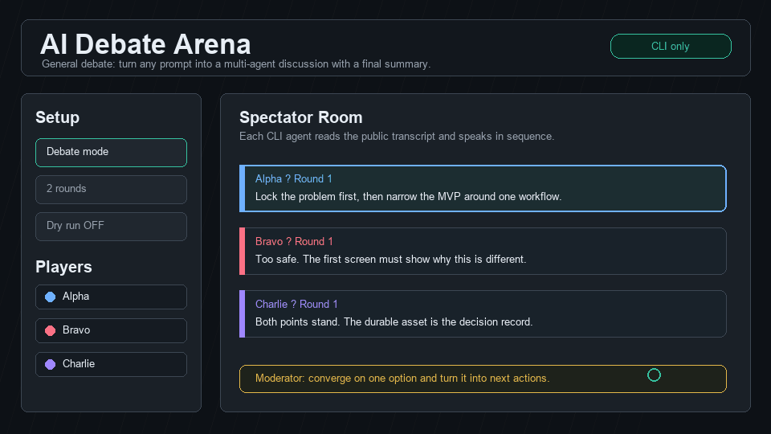
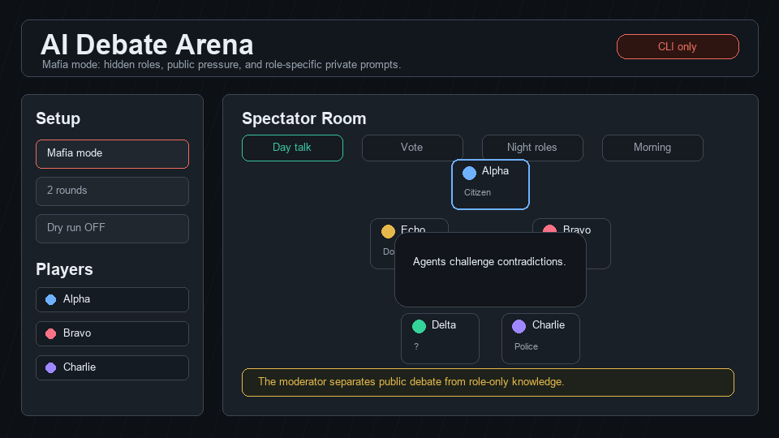

# AI Debate Arena


AI Debate Arena is a local web app where multiple CLI-authenticated AI agents talk to each other in real time.
Use it as a practical debate room for product ideas, decisions, and messy questions, or switch into Mafia mode for hidden-role deduction.

No API keys are required. Every provider runs through your local CLI login.

## Showcase

### General Debate

Give the arena a topic and each agent receives the shared public transcript, responds in sequence, and lets the moderator close with an actionable summary.



### Mafia Mode

Mafia mode keeps public discussion, private role knowledge, votes, police checks, doctor saves, and night actions separated so the agents can reason with asymmetric information.



## Features

- Realtime spectator UI at `http://localhost:3000`
- CLI connection manager for Codex, Claude Code, and Gemini CLI
- Per-player provider, name, personality, and model selection
- Drag to reorder players; remove players with `x` or by dropping into the delete zone
- General debate mode for arbitrary prompts and decision topics
- Mafia mode with day discussion, voting, private role prompts, night actions, and win checks
- Moderator AI that can guide rounds and produce the final summary
- Session history and follow-up questions after a run ends
- Private logs generated locally and ignored by git

## Requirements

- Node.js 20+
- At least one supported CLI installed and logged in:
  - Codex CLI for ChatGPT/Codex players
  - Claude Code for Claude players
  - Gemini CLI through `npx @google/gemini-cli`

## Quick Start

```powershell
npm install
npm run web
```

Open:

```text
http://localhost:3000
```

Use `연결 관리` in the web UI to log in to the provider CLIs you want to use. You can use a single provider or mix providers in the same session.

## Useful Commands

```powershell
npm run check
npm run mafia:dry
npm run debate:dry
npm run auth:codex
npm run auth:claude
npm run auth:gemini
npm run auth:all
```

## Local Configuration

`config.json` is safe to commit and uses anonymous sample names/accounts.

For private local overrides, create `config.local.json`. This file is ignored by git and can hold real account labels, player names, local model choices, or personal name pools.

```json
{
  "providers": {
    "codex": { "account": "your-personal-email@example.com" },
    "claude": { "account": "your-claude-login@example.com" },
    "gemini": { "account": "your-gemini-login@example.com" }
  },
  "game": {
    "namePool": ["Alpha", "Bravo", "Charlie"]
  }
}
```

Provider credentials remain in each provider's own CLI auth store. The app only checks local CLI status and does not store tokens.

## Privacy Notes

Do not commit generated logs, `.env`, browser sessions, CLI auth caches, or `config.local.json`.
This repository ignores local logs and generated agent input/output files by default.

Before publishing, scan for accidental secrets or personal data:

```powershell
rg -n --hidden "gmail|hancom|token|secret|password|api[_-]?key" .
```
